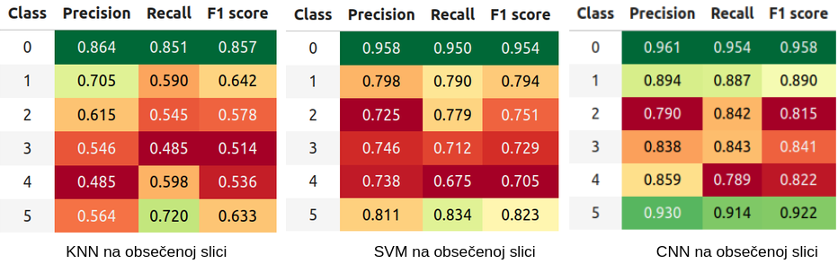
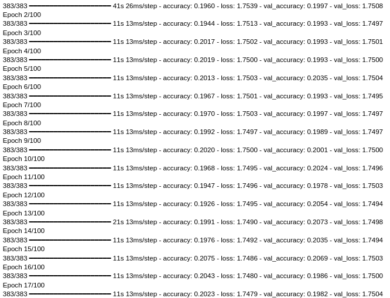
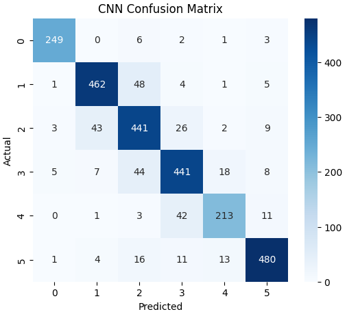

# <H1>Detekcija broja podignutih prstiju pomoću klasičnih modela (KNN, kernelizovani SVM) i konvolutivnih neuronskih mreža</H1>

Slike su skalirane na fiksnu kvadratnu dimenziju, dok su pikseli konvertovani u jedan ulazni kanal (grayscale, crno-bele slike) i normalizovani na opseg vrednosti \[0,1].

## <H2>Rezultati na prvobitnom skupu podataka</H2>

Korišćeni skup je opisan u [../src/yolo_detection/README.md](https://github.com/marko-lazarevic/ml-fingers-matf/blob/main/src/yolo_detection/README.md), a u pitanju je skup [Fingers numbers](https://universe.roboflow.com/hands-rirpj/fingers-numbers). 

Sveska: [../src/classic_models/knn_old_dataset_01.ipynb](https://github.com/marko-lazarevic/ml-fingers-matf/blob/main/src/classic_models/knn_old_dataset_01.ipynb).

Da bi sveska bila ponovno pokrenuta potrebno je preuzeti skup podataka sa navedenog linka (pri preuzimanju odabrati opcije download dataset zip file i download zip file to computer) i raspakovati ga u korenom direktorijumu repozitorijuma (ml-fingers-matf).
Ispitivano je više instanci knn, a kao nabolja na test skupu se pokazala ona koja koristi standard skejler za dodatnu normalizaciju podataka, PCA da izdvoji 100 najznačajnijih komponenti i broj najbližih suseda koji iznosi 5. Veličine slika 32x32 su se pokazale kao najbolje.

Model, iako je pokazao tačnost od preko 70%, ne uspeva dobro da klasifikuju slike koje ne pripadaju skupu podataka, zbog već opisanih mana skupa podataka.

## <H2>Rezultati na novom skupu podataka</H2>

Korišćeni skup je opisan u [../src/yolo_detection/README.md](https://github.com/marko-lazarevic/ml-fingers-matf/blob/main/src/yolo_detection/README.md), a u pitanju je skup [Podsku skupa HaGRID](https://www.kaggle.com/datasets/markolazarevi/hagrid-fingers-yolo).

Da bi knn i svm sveske bile ponovno pokrenute potrebno je preuzeti skup podataka sa navedenog linka i raspakovati ga u novom kreiranom direktorijumu fingers_yolo koji treba da bude u direktorijumu iznad korenog direktorijuma repozitorijuma (ml-fingers-matf).
Da bi sveska raw_cnn (konvolutivne) bila pokrenuta potrebno je prilagoditi sve putanje u kodu ili je jednostavno pokrenuti na sajtu [raw-cnn](https://www.kaggle.com/code/mrkkopr/raw-cnn) za šta je potrebna prijava. Sveska koja je dostupna u okviru repozitorijuma je preuzeta sa navedenog linka. 

Klasični modeli i modeli konvolutivnih neuronskih mreža pokazali su nisku tačnost pri klasifikaciji slika po broju podignutih prstiju kada se kao ulaz koristi cela slika. Osnovni uzrok ovog problema je činjenica da šaka zauzima relativno mali deo slike, dok dominantan deo čini pozadina, a ovi modeli nemaju dovoljo dobar mehanizam usmeravanja pažnje na određeni deo slike. Konvolutivne neuronske mreže su se pokazale najveću tačnost pri klasifikaciji. Za razliku od klasičnih modela, konvolutivna neuronska mreža je uspela da postigne mnogo bolju tačnost klasifikacije na trening skupu, ali zbog toga što je model uspeo da se preprilagodi podacima.

Mnogo bolja tačnost klasifikacije postignuta je kada se slika obseče samo da sadrži deo koji upada u bounding box oko šake (što se kao informacija izvlači iz skupa podataka). Konvolutivne neuronske mreže su ponove pokazale najveću tačnost pri klasifikaciji, što je i očekivano. 
U nastavku je dato poredjenje rezultat modela po odredjenim statistikama. 

---

## Detekcija broja podignutih prstiju pomoću KNN modela

Odabir hiperparametara broja suseda i dimenzija ulaznih slika izvršen je sistematičnom pretragom svih kombinacija iz skupa zadatih parametara. Model je treniran na trening skupu, dok je kao kriterijum izbora korišćena tačnost na validacionom skupu.

Ispitivani hiperparametri bili su:

- dimenzije ulaznih slika: 16×16, 32×32, 64×64 i 128×128  
- broj suseda: 3, 6, 9, 15, 35, 50, 100 i 500  

### Rezultati bez lokalizacije (cela slika)

Najbolji rezultat postignut je za 16×16 i 500 suseda, sa tačnošću od **21,83%** na test skupu. Ovaj rezultat potvrđuje da KNN, kao metod zasnovan na rastojanju između vektora piksela, ne može da izdvoji relevantne informacije kada dominantan deo ulaza čini pozadina. Ovaj model je samo za oko trećinu bolji od nasumične klasifikacije (čija bi očekivana tačnost bila 16,66%). 

---

### Rezultati sa lokalizacijom šake (bounding box)

Nakon izdvajanja regiona šake korišćenjem YOLO koordinata ograničavajućeg pravougaonika (*bounding box*) uz dodatnu marginu od 10%, primenjena je ista procedura optimizacije hiperparametara.

Ispitivani parametri bili su:

- dimenzije: 8×8, 16×16, 32×32 i 64×64  
- broj suseda: 3, 6, 9, 15, 35, 50, 100 i 500  

Najbolja konfiguracija bila je 16×16 i 6 suseda, sa:

- tačnošću na validacionom skupu od **62,95%**  
- tačnošću na test skupu od **61,27%**

Ovo predstavlja poboljšanje od skoro 2 puta u odnosu na model koji koristi celu sliku.

---

## Detekcija broja podignutih prstiju pomoću kernelizovanog SVM modela

Iz originalnih slika izdvojen je region šake korišćenjem YOLO anotacija, uz dodatnu marginu od 10%.

Izdvojeni region je zatim:

- konvertovan u grayscale  
- transformisan u kvadratni oblik  
- skaliran na željenu rezoluciju  

Ponovo je vršena sistematična pretraga hiperparametara

- rezolucije slike: 16×16 i 32×32 piksela
- C: 0.1, 1, 10  
- γ: 0.1, 1, 10  
- kernel: RBF  

Najbolji rezultati su uočeni za rezoluciju slike 16x16, C = 10 i γ = 0.1 i to:

- tačnost na validacionom skupu od **79,54%**  
- tačnost na test skupu od **78,53%**

Tačnost je odskočila za skoro četvrtinu u odnosu na KNN model.

## Detekcija broja podignutih prstiju pomoću CNN modela

Sveska u kojoj se može videti proces treniranja i evaluacije modela [raw-cnn](https://www.kaggle.com/code/mrkkopr/raw-cnn)

Ponovo je vršena sistematična pretraga hiperparametara konvolutivne neuronske mreže, pri čemu su ispitivane sledeće kombinacije i to za
1) čitavu sliku:
    - rezolucije ulazne slike: 128×128 i 256×256 piksela  
    - broj konvolutivnih slojeva: 2 i 3  
    - broj filtera u prvom konvolucionom sloju: 32 (nakon čega se broj duplira u svakom sledećem)  
    - dimenzije kernela: 3×3  
    - dimenzije matrice agregacije: 2×2  
    - način na koji se dvodimenzion vektor pretvara u jednodimenzioni: prosečna vrednost čitave matrice  
    - broj skrivenih slojeva potpuno povezane neuronske mreže: 0, 1 i 2  
    - broj neurona u prvom sloju: 128 (nakon čega se broj smanjuje duplo u svakom sledećem)  
    - verovatnoća gašenja neurona u poslednjem skrivenom sloju potpuno povezane mreže: 0.5  
2) bounding box:
    - rezolucije ulazne slike: 64×64, 128×128 i 256×256 piksela  
    - broj konvolutivnih slojeva: 2 i 3  
    - broj filtera u prvom konvolucionom sloju: 32 (nakon čega se broj duplira u svakom sledećem)  
    - dimenzije kernela: 3×3  
    - dimenzije matrice agregacije: 2×2  
    - način na koji se dvodimenzion vektor pretvara u jednodimenzioni: prosečna vrednost čitave matrice  
    - broj potpuno povezanih (dense) slojeva: 0 i 1  
    - broj neurona u prvom dense sloju: 128 (nakon čega se broj smanjuje duplo u svakom sledećem)
    - verovatnoća gašenja neurona u poslednjem skrivenom sloju potpuno povezane mreže: 0.4  

### Rezultati bez lokalizacije (cela slika)

Najbolja konfiguracija bila je:

- dimenzije: 128×128 piksela
- konvolucionih slojeva: 3
- broj filtera: 32
- broj skrivenih slojeva potpuno povezan mreže: 0

Rezultati iz epoha se mogu videti na slici iznad.
Postignuta tačnost je bila 37,61% u epohi 99. Prvih 17 epoha model nije uspeo da nauči bilo kakave korisne karakteristike (tačnost je oscilovala oko 20% i na trening i na validacionom skupu). Do 31. epohe model uči većinom korisne karakteristike koje pomažu u boljoj generalizaciji, što se uočava na osnovu skoka tačnosti sa oko 20% na 26,52%, koja je približno ista i na validacionom i na trening skupu. U sledećim epohama model se u najvećoj meri prepilagođava dostižući tačnost od preko 70% na trening skupu. Ipak, uspeva da poboljša tačnost i na validacionom skupu na 37,61% (odnosno 38,64%), što je značajno veća tačnost u odnosu na KNN, ali nedovoljno velika za bilo kakvu praktičnu upotrebu.

---

### Rezultati sa lokalizacijom šake (bounding box)

Najbolja konfiguracija bila je:

- dimenzije: 64x64 piksela
- konvolucionih slojeva: 3
- broj filtera: 32
- broj skrivenih slojeva potpuno povezan mreže: 1
- broj neurona u prvom skrivenom sloju potpuno povezane mreže: 128
- verovatnoća gašenja neurona: 0.4

Postignuta je tačnost od 88,83% na validacionom skupu u 99. epohi. Najveći skok u tačnosti je primećen u prve 23 epohe, kada je ona dostigla oko 84%, nakon čega je model imao veću tendenciju da se prepilagodi trening skupu, a ne da nauči karakteristike same raspodele. Postignuta tačnost na test skupu iznosila je 89,4%. CNN je imao bolju preciznost i odziv za svaku od klasa u odnosu na klasične modele. 
U nastavku je data slika matrice konfuzije na test skupu.

---

## Zaključak

Kao najvažnija informacija modelu se pokazala lokacija šake na slici i uklanjanje šuma u vidu pozadine. CNN model je pokazao veću tačnost, preciznost i odziv za svaku od klasa u odnosu na klasične modele.

