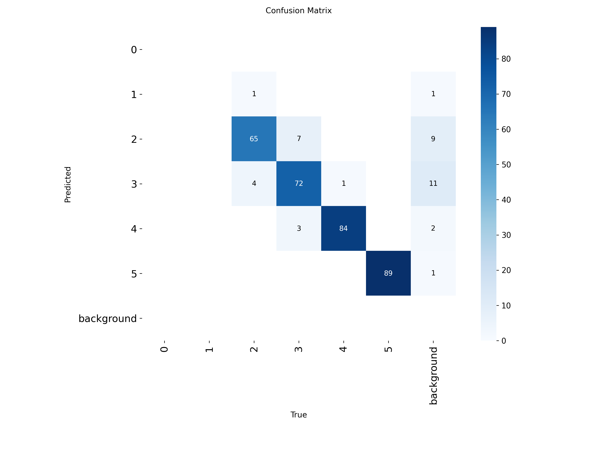
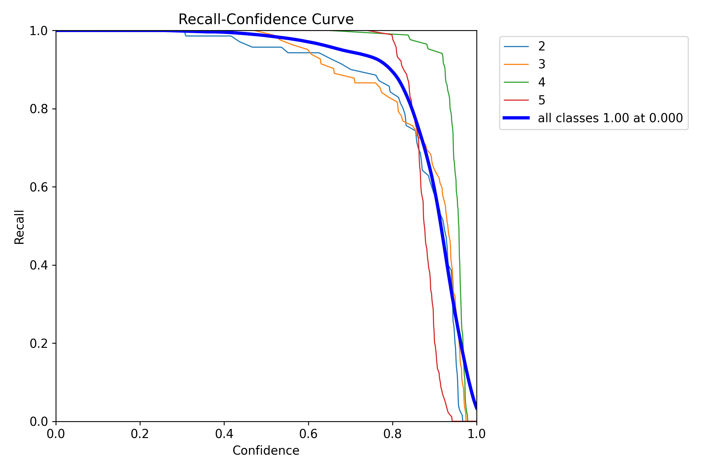
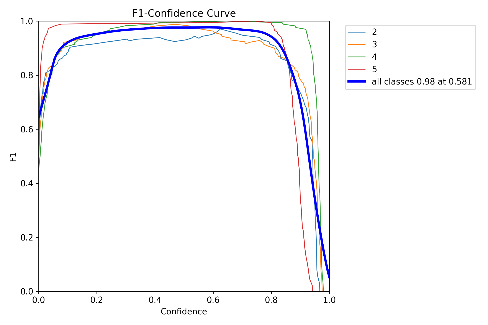
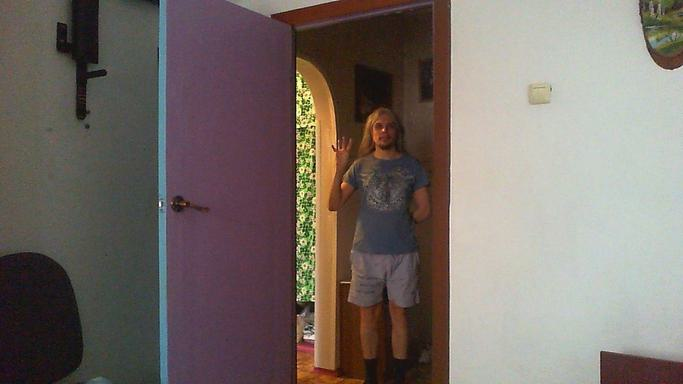
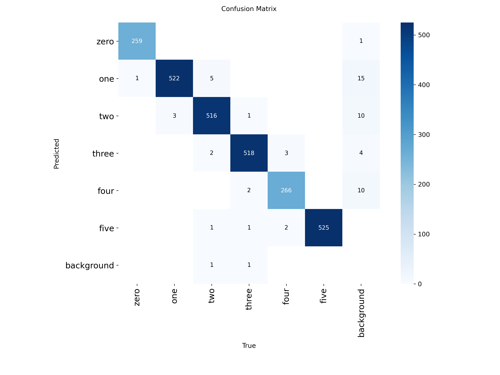
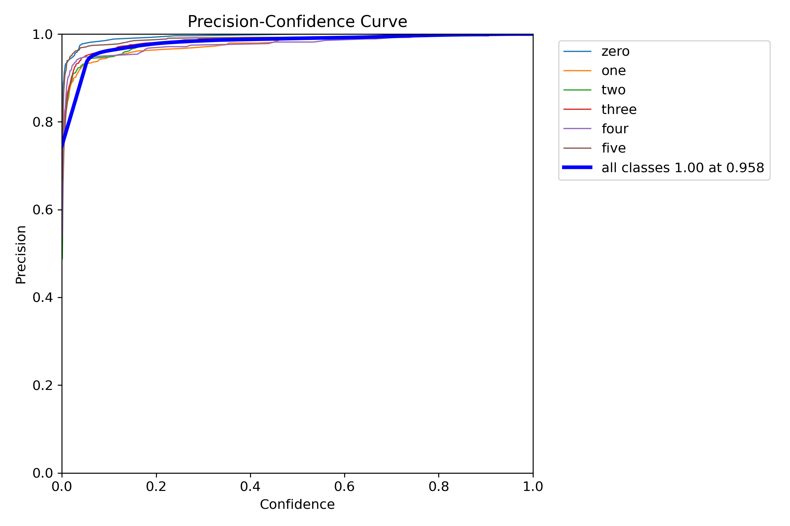
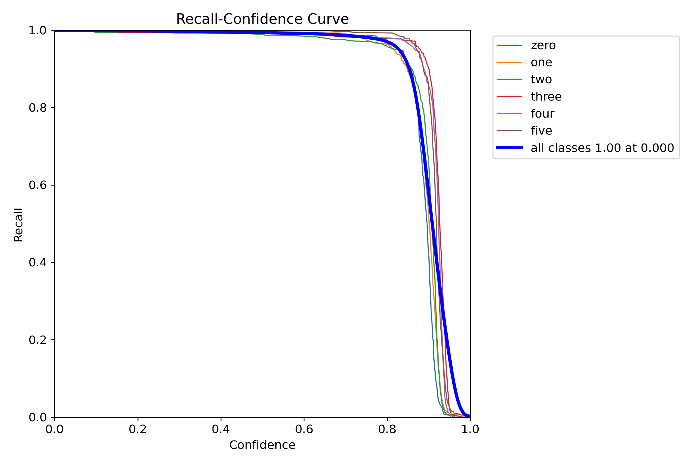
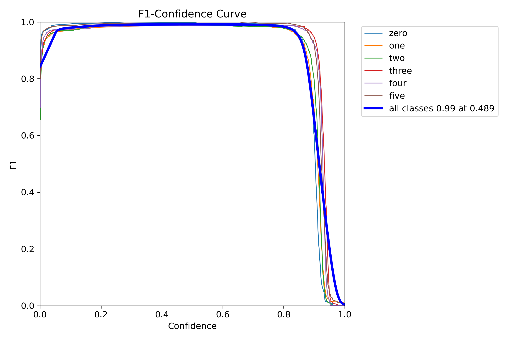
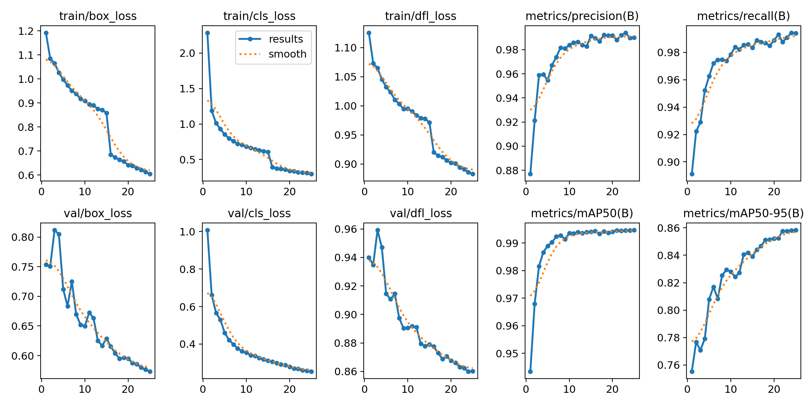

# Detekcija pozicije šake i broja podignutih prstiju pomoću modela Yolo familije

## YOLO

[YOLO modeli](https://docs.ultralytics.com/models) predstavljaju familiju pretreniranih konvolutivnih neuronskih mreža pogodnih za različite zadatke kao što su detekcija objekata, segmentacija objekata, detektovanje ključnih tačaka (keypoints), klasifikaciju i slično. Ova familija predstavlja industrijski standard za zadatke obrade slika i iz tog razloga odabrani su kao deo ovog projekta.

## Cilj

Cilj koji smo želeli da ostavirmo je kreiranje modela za prepoznavanje pozicije šake na slici i prepoznavanje broja podignutih prstiju, odnosno klasifikaciju sa klasama 0,1,2,3,4,5.

## Kreiranje modela

U toku našeg rada bilo je nekoliko pokušaja treniranja modela YOLO familije, a ovde ćemo ih podeliti i opisati prema skupovima podataka koji su korišćeni. Razlog za ovakvu podelu je to što je promena skupa podataka i bolja priprema podatak napravila prekretnicu u našem projektu.

### Pokušaj 1

Skup podatak koji smo koristili u prvom pokušaju može se pogledati [ovde](https://universe.roboflow.com/hands-rirpj/fingers-numbers). Na prvi pogled ovaj skup je delovao jako dobro, specifično je napravljen za problem koji smo mi želeli da rešavamo, prolaskom kroz određeni broj slika delovalo je da je raspodela podataka dosta dobra i očekivali smo dobre rezultate.

Model smo trenirali više puta sa varijacijama hiperparametara i samog pretreniranog modela ali ovde ćemo opisati jedan uopšten proces i zaključak jer su varijacije između modela minimalne.

Prvi problem na koji smo naišli je da skup podataka nije imao validacione podatke koje YOLO zahteva za treniranje. Validacioni skup smo izdvojili iz trening skupa nasumičnim izborom slika.

Tokom treniranja dobili smo sjajne rezultate, skoro pa zabrinjavajuće, a evaluacijom na test skupu dodatno smo potvrdili te rezultate. Naredne slike pokazuju metrike na test skupu sa različitim vrednostima confidence parametra.

Matrica konfuzije:


Kriva preciznosti (precision):


Kriva odziva (recall):


Kriva F1 mere:


Iz matrice konfuzije (kao i iz legendi ostalih grafika) jasno se vidi da u test skupu u potpunosti nedostaju klase 0 i 1. Ovako definisan test skup je došao integrisan uz sam skup podataka, što predstavlja ozbiljan nedostatak njegove strukture i direktno utiče na nemogućnost kompletne evaluacije modela na tom koraku.

Iako sjajni rezultati i metrike, pokušaj klasifikacije ovim modelom na slikama koje smo sami kreirali nije bio uspešan.

Na narednim slikama možemo videti primere po jedne slike klase dva iz skupa za trening, validaciju i test redom:


Jasno je da se praktično isti podatak nalazi u sva tri skupa. Samim tim model se ponaša izvanredno na validacionom i test skupu ali dalje od toga ne može. Ovom analizom utvrdili smo da skup podataka korišćen u prvom pokušaju nije adekvatan pa smo se odlučili za pronalazak novog skupa podataka.

Iako smo validacioni skup izdvojili nasumičnim izborom to nije bio najveći problem. U samom skupu podataka raspodela je jako loša sve slike su slikane sa slične udaljenosti u sličnim uslovima osvetljenja sa pozadinama u kojima se šaka jasno izdvaja.

### Pokušaj 2

Za drugi pokušaj rešavanje našeg problema pronašli smo skup podataka [HaGRID](https://github.com/hukenovs/hagrid). Ovaj skup ima preko milion slika, sa preko 60.000 različitih osoba i scena bez ponavljanja slika i bez velike sličnosti u istim klasama. Samim tim ovaj skup omogućava jednostavno deljenje na skupove za trening, test i validaciju. Ipak slike u ovom skupu su FullHD rezolucije i ukupno zauzimaju preko 1.5TB memorije. Drugi problem je što su klase slika drugačije od onih koje su potrebne za naš projekat.

Na narednim slikama možemo videti varijaciju raspodele klase 4 na primeru dve slike:




Prvi problem rešili smo pronalaženjem podskupa originalnog skupa podataka koji ima 30k slika rezolucije 384p i nalazi se [ovde](https://www.kaggle.com/datasets/innominate817/hagrid-sample-30k-384p).

Drugi problem rešili smo reklasifikovanjem datih klasa. U narednoj tabeli prikazano je kako smo grupisali klase:

| Nova klasa | Stare klase                                                |
| ---------- | ---------------------------------------------------------- |
| 0          | fist                                                       |
| 1          | dislike, like, middle_finger, mute, one                    |
| 2          | call, peace, peace_inverted, rock, two_up, two_up_inverted |
| 3          | three, three2, three3                                      |
| 4          | four                                                       |
| 5          | palm, stop, stop_inverted                                  |
| Uklonjeno  | grabbing, grip, no_gesture, ok, point                      |

Uklonjene klase nisu mogle deterministički biti rasporedjene u neku od novih klasa pa su iz tog razloga u potpunosti uklonjene.

Za potrebe reklasifikacije i pripreme podataka kreirali smo [kaggle notebook](https://www.kaggle.com/code/markolazarevi/hagrid-reclass-yolo) gde smo direktno ulazni dataset obradili, reklasifikovali i kreirali novi dataset.

Ulazni podaci nakon reklasifikacije bili su raspoređeni na sledeći način:

```
0 1735
1 5321
2 10630
3 3488
4 1805
5 5321
```

Kako klase ne bi bile previše nebalansirane klase koje imaju mnogo više instanci smo smanjili na sledeće veličine:

```
TARGET_COUNTS = {
    0: 1735,
    1: 3500,
    2: 3500,
    3: 3488,
    4: 1805,
    5: 3500,
}
```

Na kraju smo podatke podelili na skupove za trening, validaciju i test i dobili skupove sledećih dimenzija:

```
Train: 12268
Val: 2628
Test: 2632
```

> Napomena: Nasumična podela podataka u ovom slučaju je u potpunosti validna zbog prirode skupa podataka.

Slike i njihove labele smo na kraju rasporedili u odgovarajuće direktorijume i kao izlaz dobili [novi dataset](https://www.kaggle.com/datasets/markolazarevi/hagrid-fingers-yolo) koji je bio spreman za yolo modele.

Na kraju smo kreirali notebook koji je kao ulaz imao prethodno kreirani dataset i u kom smo trenirali standardan yolo model. Notebook se može videti [ovde](https://www.kaggle.com/code/markolazarevi/yolo-fingers).

Tokom treninga dobili smo bolje rezultate nego sa prethodnim skupom podataka. Iako je raspodela podataka kompleksnija, sam skup podataka je dosta bogatiji što je modelu omogućilo da ga dobro nauči. Takođe model je na neviđenim podacima (slikama sa naše veb kamere) pokazao sjajne rezultate.

Naredne slike pokazuju metrike na validacionom skupu podataka.

Matrica konfuzije:


Kriva preciznosti (precision):


Kriva odziva (recall):


Kriva F1 mere:


Naredni grafikoni prikazuju krive gubitka i metrike evaluacije kroz epohe za model treniran na modifikovanom HaGRID skupu podataka:



Kratka analiza prikazanih rezultata:

- Loss krive: Sve tri komponente gubitka Box loss (greška lokalizacije bounding box-a), Cls loss (greška klasifikacije broja prstiju) i DFL loss (gubitak fokalne distribucije) stabilno i sinhronizovano opadaju na trening i na validacionom skupu podataka kroz svih 25 epoha. Činjenica da validacioni gubitak prati trend pada trening gubitka predstavlja ključni dokaz da je model uspešno generalizovao naučene oblike i da ne dolazi do preprilagođavanja. Nagli pad i stabilizacija kriva oko 15. epohe je karakterističan za YOLO arhitekture (najčešće usled gašenja mosaic augmentacije u završnim epohama ili modifikacije stope učenja).
- Metrike:
  - Preciznost i Odziv: Obe metrike beleže brz rast u početnim epohama i stabilizuju se na vrednostima blizu 99%, što ukazuje na izuzetno nizak procenat lažno pozitivnih i lažno negativnih detekcija.
  - mAP50: Srednja prosečna preciznost pri IoU pragu 0.5 dostiže stabilnu vrednost od 0.995 (99.5%) za sve klase kombinovano.
  - mAP50-95: Stroža i industrijski standardizovana metrika koja računa prosek kroz više IoU pragova (od 0.5 do 0.95) dostiže izvanrednih 0.86 (86%), što potvrđuje visoku robusnost i preciznost modela u kompleksnim i raznolikim realnim scenama.
