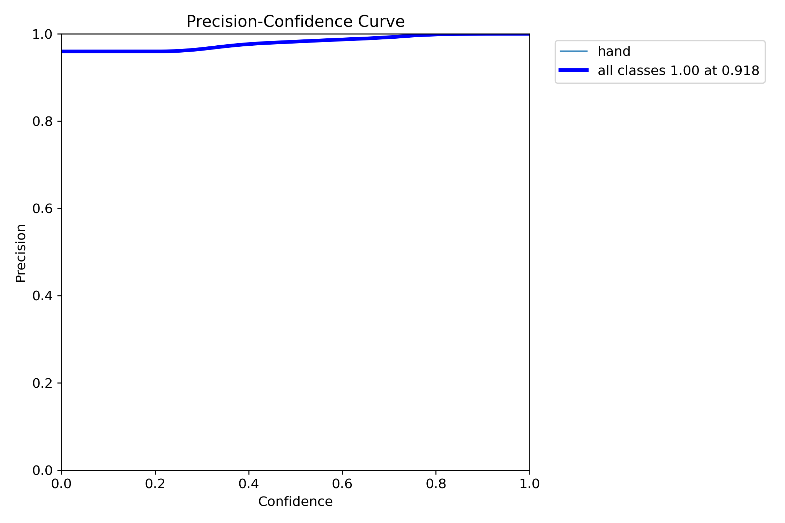
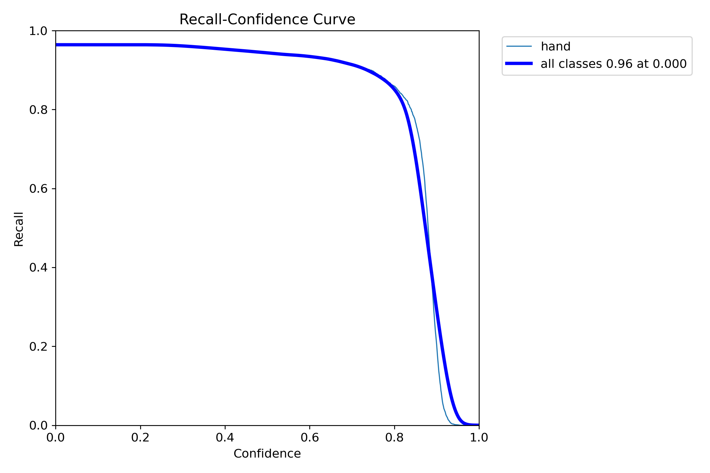
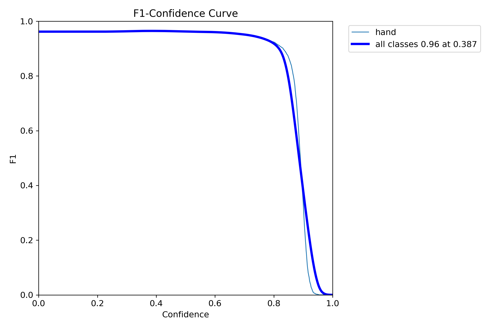
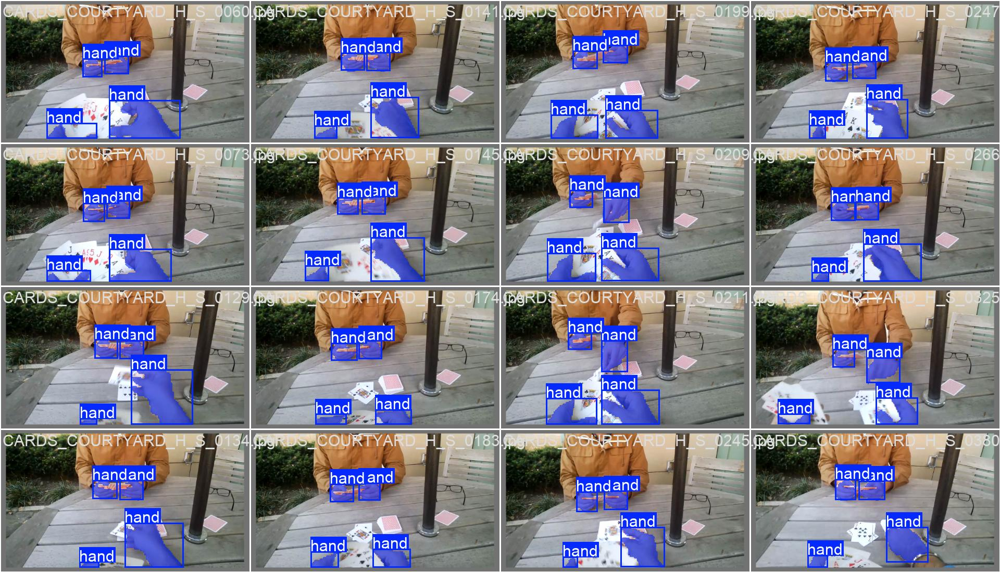

# Segmentacija instanci šake pomoću YOLO modela

## Opis celine

U ovoj celini projekta fokus je na **segmentaciji instance šake** (piksel maska šake), a ne samo na bounding box detekciji.
Cilj je bio da se istrenira model koji će prepoznavati instancu šake sa slika prednje kamere, što nisam u potpunosti uspeo u nastavku ću opisati moje uvide zašto, ono što ovaj model radi zadovoljavajuće je segmentacija instanci na novim slikama koje su FPV.
Prvi pokušaj je treniranje YOLO8n modela za segmentaciju [EgoHands](https://www.kaggle.com/datasets/himaniishah/egohands) skupu podataka čije ćemo rezultate prikazati u nastavku, a zatim sam imao ideju da probam da poboljšam predvidjanje na našem željenom primeru kombinovanjem sa još jednim [skupom podataka.](https://www.kaggle.com/datasets/thebestpatate/11k-hands-segmented-with-sam3-yolo-format)

## Korišćeni skupovi podataka

1. **EgoHands**  
   Korišćen za osnovni segmentacioni trening i testiranje.
2. **Hands segmented (filtered)**  
   Korišćen za pokusaj popravke modela za rad sa slikama sa prednje kamere.
Datasetovi nisu deo ovog repozitorijuma, potrebno ih je preuzeti sa linkova [EGO Hands](https://www.kaggle.com/datasets/himaniishah/egohands) i [Hands segmented](https://www.kaggle.com/datasets/thebestpatate/11k-hands-segmented-with-sam3-yolo-format) raspakovati u src\yolo_instance_segmentation\data folder.

## Struktura i fajlovi

- `00_data_processing.ipynb`  
  Priprema EgoHands podataka za YOLO format (train/val/test), konverzija poligona i generisanje `data.yaml`. Kako se u ovom skupu podataka nalaze frejmovi videa bilo je potrebno voditi racuna da frejmovi iz jednog videa idu u isti skup podataka.
- `01_cpu_quick_seg.ipynb`  
  Trening `yolov8n-seg` modela na EgoHands skupu i evaluacija.
- `03_combined_seg_fast.ipynb`  
  Trening na spojenom skupu (EgoHands + filtered) i evaluacija.
- `merge_datasets.py`  
  Validira skupove i generiše `data/combined_data.yaml` za combined trening.
- `evaluate_yolo.py`  
  Helper funkcije za evaluaciju metrika, pronalazak najboljih težina i prikaz predikcija.

## Tok rada (redosled)
1. Pokrenuti `00_data_processing.ipynb`  
   - kreira `data/egohands_yolo/`
   - pravi `images/{train,val,test}` i `labels/{train,val,test}`
   - generiše `data/egohands_yolo/data.yaml`
2. Pokrenuti `01_cpu_quick_seg.ipynb`  
   - trenira bazni segmentacioni model na EgoHands
   - čuva rezultate u `runs/segment/.../cpu_quick_seg/`
3. Pokrenuti `03_combined_seg_fast.ipynb`  
   - pravi `data/combined_data.yaml`
   - radi fine-tuning na kombinovanom skupu
   - čuva rezultate u `runs/segment/.../combined_seg_fast/`

## Konfiguracioni YAML fajlovi
- `data/egohands_yolo/data.yaml`  
  Definiše train/val/test split za EgoHands.
- `data/combined_data.yaml`  
  Definiše kombinovani train/val (EgoHands + filtered) i test (EgoHands).

Rezultati:

Naredne slike prikazuju metrike na test skupu sa različitim vrednostima confidence parametra za model iz `01_cpu_quick_seg.ipynb`:

Kriva preciznosti (precision):

Kriva odziva (recall):

Kriva F1 mere:

Primer predvidjanja na test skupu 

Ovaj model ima vrlo dobre rezultate na test skupu.

Primer predvidjanja na novim podacima moze se videti u folderu:
`yolo_instance_segmentation\predictions\predictions`

Ovde mozemo videti da ovaj model se dobro ponasa i za potpuno nove fotografije ali koje pripadaju domenu fotografija iz EgoHands skupa (FPV ftografije), dok za ostale uopste ne radi kako treba, što me je navelo da probam da dotreniram ovaj model da skupu podataka koji ce pored EgoHAnds fotografija sadryati i dodatne fotografije šaka kako bi ovaj model bolje generalizovao segmetaciju instaci šaka u različitim uslovima.

Naredne slike prikazuju metrike na test skupu sa različitim vrednostima confidence parametra za model iz `03_combined_seg_fast.ipynb`:
