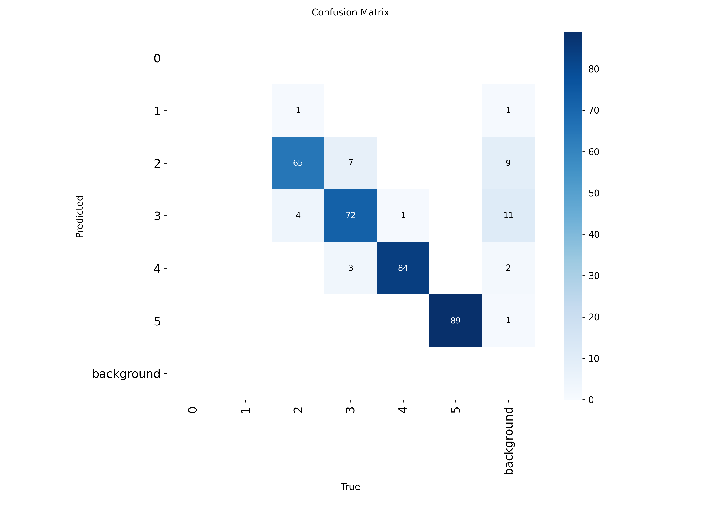
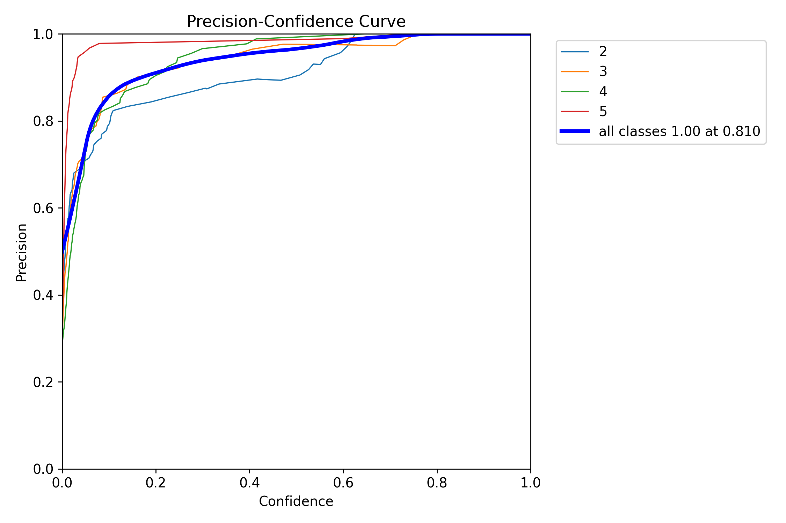
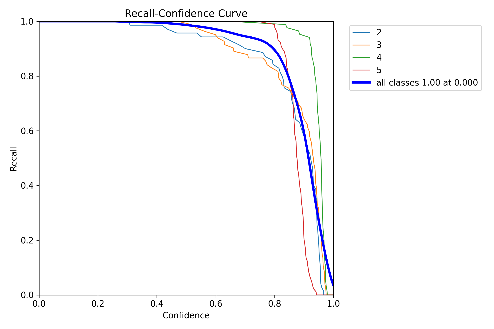
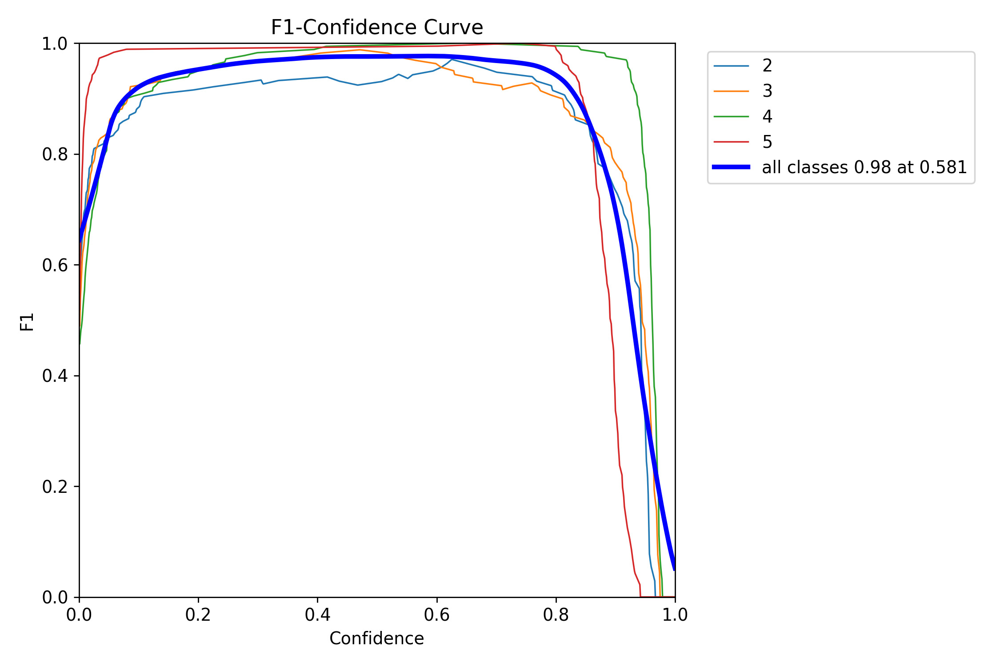

# Detekcija pozicije šake i broja podignutih prstiju pomoću modela Yolo familije

## YOLO

[YOLO modeli](https://docs.ultralytics.com/models) predstavljaju familiju pretreniranih konvolutivnih neouronskih mreža pogodnih za različite zadatke kao što su detekcija objekata, segmentacija objekata, detektovanje ključnih tačaka (keypoints), klasifikaciju i slično. Ova familija predstavlja industrijski standard za zadatke obrade slika i iz tog razloga odabrani su kao deo ovog projekta.

## Cilj

Cilj koji smo želeli da ostavirmo je kreiranje modela za prepoznavanje pozicije šake na slici i prepoznavanje broja podignutih prstiju, odnosno klasifikacij sa klasama 0,1,2,3,5.

## Kreiranje modela

U toku našeg rada bilo je nekoliko pokušaja treniranja modela YOLO familije, a ovde ćemo ih podeliti i opisati prema skupovima podataka koji su korišćeni. Razlog za ovakvu podelu je to što je promena skupa podataka i bolja priprema podatak napravila prekretnicu u našem projektu.

### Pokušaj 1

Skup podatako koji smo koristili u prvom pokušaju može se pogledati [ovde](https://universe.roboflow.com/hands-rirpj/fingers-numbers). Na prvi pogled ovaj skup je delovao jako dobro, specifično je napravljen za klasifikaciju koju smo mi želeli da radimo, prolaskom kroz određeni broj slika delovalo je da je raspodela podataka dosta dobra i očekivali smo dobre rezultate.

Model smo trenirali više puta sa varijacijama hiperparametara i samog pretreniranog modela ali ovde ćemo opisati jedan uopšten proces i zaključak jer su variajcije između modela dosta različite.

Prvi problem na koji smo naišli je da skup podataka nije imao validacione podatke koje YOLO zahteva za treniranje. Validacioni skup smo izdvojili iz trening skupa nasumičnim izborom slika.

Tokom treniranja dobili smo sjajne rezultate, skoro pa zabrinjavajuće, a evaluacijom na test skupu dodatno smo potvrdili te rezultate. Naredne slike pokazuju metrike na test skupu sa različitim vrednostima confidence parametra.

Matrica konfuzije:

Kriva preciznosti (precision):

Kriva odziva (recall):

Kriva F1 mere:

Iz matrice konfuzije vidimo da u test skupu nedostaju klase 0 i 1.

Iako sjajni rezultati, pokušaj klasifikacije ovim modelom na slikama koje smo sami kreirali nije bio uspešan.
