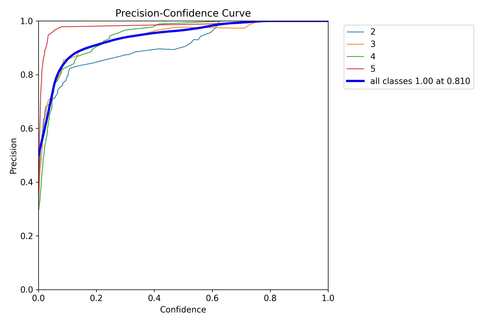
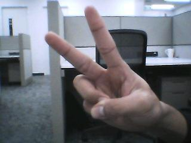

# Detekcija pozicije šake i broja podignutih prstiju pomoću modela Yolo familije

## YOLO

[YOLO modeli](https://docs.ultralytics.com/models) predstavljaju familiju pretreniranih konvolutivnih neouronskih mreža pogodnih za različite zadatke kao što su detekcija objekata, segmentacija objekata, detektovanje ključnih tačaka (keypoints), klasifikaciju i slično. Ova familija predstavlja industrijski standard za zadatke obrade slika i iz tog razloga odabrani su kao deo ovog projekta.

## Cilj

Cilj koji smo želeli da ostavirmo je kreiranje modela za prepoznavanje pozicije šake na slici i prepoznavanje broja podignutih prstiju, odnosno klasifikacij sa klasama 0,1,2,3,5.

## Kreiranje modela

U toku našeg rada bilo je nekoliko pokušaja treniranja modela YOLO familije, a ovde ćemo ih podeliti i opisati prema skupovima podataka koji su korišćeni. Razlog za ovakvu podelu je to što je promena skupa podataka i bolja priprema podatak napravila prekretnicu u našem projektu.

### Pokušaj 1

Skup podatako koji smo koristili u prvom pokušaju može se pogledati [ovde](https://universe.roboflow.com/hands-rirpj/fingers-numbers). Na prvi pogled ovaj skup je delovao jako dobro, specifično je napravljen za klasifikaciju koju smo mi želeli da radimo, prolaskom kroz određeni broj slika delovalo je da je raspodela podataka dosta dobra i očekivali smo dobre rezultate.

Model smo trenirali više puta sa varijacijama hiperparametara i samog pretreniranog modela ali ovde ćemo opisati jedan uopšten proces i zaključak jer su variajcije između modela dosta različite.

Prvi problem na koji smo naišli je da skup podataka nije imao validacione podatke koje YOLO zahteva za treniranje. Validacioni skup smo izdvojili iz trening skupa nasumičnim izborom slika.

Tokom treniranja dobili smo sjajne rezultate, skoro pa zabrinjavajuće, a evaluacijom na test skupu dodatno smo potvrdili te rezultate. Naredne slike pokazuju metrike na test skupu sa različitim vrednostima confidence parametra.

Matrica konfuzije:


Kriva preciznosti (precision):


Kriva odziva (recall):


Kriva F1 mere:


Iz matrice konfuzije vidimo da u test skupu nedostaju klase 0 i 1.

Iako sjajni rezultati i metrike, pokušaj klasifikacije ovim modelom na slikama koje smo sami kreirali nije bio uspešan.

Na narednim slikama možemo videti primere po jedne slike klase dva iz skupa za trening, validaciju i test redom:




Jasno je da se praktično isti podataka nalazi u sva tri skupa. Samim tim model se ponaša izvanredno na validacionom i test skupu ali dalje od toga ne može. Ovom analizom utvrdili smo da skup podataka korišćen u prvom pokušaju nije adekvatan pa smo se odlučili za pronalazak novog skupa podataka.

### Pokušaj 2

Za drugi pokušaj rešavanje našeg problema pronašli smo skup podataka [HaGRID](https://github.com/hukenovs/hagrid). Ovaj skup ima preko milion slika, sa preko 60.000 različitih osoba i scena bez ponavljanja slika. Samim tim ovaj skup omogućava jednostavno deljenje na skupove za trening, test i validaciju. Ipak slike u ovom skupu su FullHD rezolucije i ukupno yauyimaju preko 1.5TB memorije. Drugi problem je što su klase slika drugačije od onih koje su potrebne za naš projekat.

Prvi problem rešili smo pronalaženjem podskupa originalnog skupa podataka koji ima 30k slika rezolucije 384p i nalazi se [ovde](https://www.kaggle.com/datasets/innominate817/hagrid-sample-30k-384p).

Drugi problem rešili smo reklasifikovanjem datih klasa. U narednoj tabeli prikazano je kako smo grupisali klase:

| Nova klasa | Stare klase                                                |
| ---------- | ---------------------------------------------------------- |
| 0          | fist                                                       |
| 1          | dislike, like, middle_finger, mute, one                    |
| 2          | call, peace, peace_inverted, rock, two_up, two_up_inverted |
| 3          | three, three2, three3                                      |
| 4          | four                                                       |
| 5          | palm, stop, stop_inverted                                  |
| Uklonjeno  | grabbing, grip, no_gesture, ok, point                      |

Za potrebe reklasifikacije kreirali smo [kaggle notebook](https://www.kaggle.com/code/markolazarevi/hagrid-reclass-yolo) gde smo direktno ulazni dataset obradili, reklasifikovali i kreirali novi dataset.

Ulazni podaci bili su raspoređeni na sledeći način:

```
0 1735
1 5321
2 10630
3 3488
4 1805
5 5321
```

Kako klase ne bi bile previše nebalansirane klase koje imaju mnogo više instanci smo smanjili na sledeće veličine:

```
TARGET_COUNTS = {
    0: 1735,
    1: 3500,
    2: 3500,
    3: 3488,
    4: 1805,
    5: 3500,
}
```

Na kraju smo podatke podelili na skupove za trening, validaciju i test i dobili skupove sledećih dimenzija:

```
Train: 12268
Val: 2628
Test: 2632
```

Slike i njihove labele smo na kraju rasporedili u odgovarajuće direktorijume i kao izlaz dobili [novi dataset](https://www.kaggle.com/datasets/markolazarevi/hagrid-fingers-yolo) koji je bio spreman za yolo modele.

Na kraju smo kreirali notebook koji je kao ulaz imao prethodno kreirani dataset i u kom smo trenirali standardan yolo model. Notebook se može videti [ovde](https://www.kaggle.com/code/markolazarevi/yolo-fingers).
